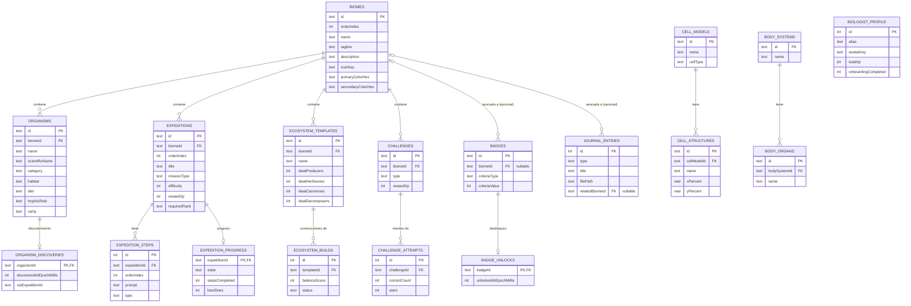

# Base de Datos — NiñoBiólogo: Exploradores de la Vida

Versión 1.0.0 · Agosto 2026

## 1. Motor y versión

- Motor: **SQLite** (embebido en Android), acceso a través de **Room 2.6.1**.
- Versión de esquema Room: **1** (instalación limpia, sin migraciones previas).
- `PRAGMA foreign_keys = ON` activo en toda sesión de base de datos.
- Fuente de verdad del esquema real usado por la app: `database/schema.sql` (generado desde las
  entidades Kotlin reales en `app/src/main/java/.../data/local/entity/`).

## 2. Resumen de tablas

18 tablas: 11 de **contenido semilla** (de solo lectura desde la perspectiva del usuario, se
insertan una única vez en la primera apertura) y 7 de **progreso** (datos reales que genera el
jugador y se actualizan continuamente).

| Tabla | Tipo | Filas semilla reales |
|---|---|---|
| `biomes` | Contenido | 5 |
| `organisms` | Contenido | 50 |
| `expeditions` | Contenido | 40 |
| `expedition_steps` | Contenido | 120 |
| `cell_models` | Contenido | 3 |
| `cell_structures` | Contenido | 11 |
| `body_systems` | Contenido | 6 |
| `body_organs` | Contenido | 18 |
| `ecosystem_templates` | Contenido | 20 |
| `challenges` | Contenido | 30 |
| `badges` | Contenido | 15 |
| `biologist_profile` | Progreso | 1 fila (perfil único) creada en el onboarding |
| `organism_discoveries` | Progreso | 0 al instalar, crece con el juego |
| `expedition_progress` | Progreso | 0 al instalar, crece con el juego |
| `challenge_attempts` | Progreso | 0 al instalar, crece con el juego |
| `badge_unlocks` | Progreso | 0 al instalar, crece con el juego |
| `ecosystem_builds` | Progreso | 0 al instalar, crece con el juego |
| `journal_entries` | Progreso | 0 al instalar, crece con el juego |

Total de INSERT reales verificados en `database/sample_data.sql`: **319** (ver
`tools/sqlite_verification.log`).

## 3. Campos, tipos, PK, FK e índices

### 3.1 Contenido

**`biomes`** — las 5 zonas del mapa
| Campo | Tipo | Restricción |
|---|---|---|
| id | TEXT | PK |
| orderIndex | INTEGER | NOT NULL |
| name | TEXT | NOT NULL |
| tagline | TEXT | NOT NULL |
| description | TEXT | NOT NULL |
| iconKey | TEXT | NOT NULL |
| primaryColorHex | TEXT | NOT NULL |
| secondaryColorHex | TEXT | NOT NULL |

**`organisms`** — los 50 seres vivos descubribles
| Campo | Tipo | Restricción |
|---|---|---|
| id | TEXT | PK |
| biomeId | TEXT | FK → `biomes.id` ON DELETE CASCADE, índice |
| name, scientificName, category, habitat, diet, trophicRole, characteristics, funFact, rarity, iconKey | TEXT | NOT NULL |

Índice adicional: `index_organisms_name` (búsqueda por nombre).

**`expeditions`**
| Campo | Tipo | Restricción |
|---|---|---|
| id | TEXT | PK |
| biomeId | TEXT | FK → `biomes.id` ON DELETE CASCADE, índice |
| orderIndex, difficulty, rewardXp | INTEGER | NOT NULL |
| title, narrative, missionType, relatedOrganismIds, requiredRank | TEXT | NOT NULL (`relatedOrganismIds` es una lista serializada mediante `Converters`) |

**`expedition_steps`**
| Campo | Tipo | Restricción |
|---|---|---|
| id | INTEGER | PK AUTOINCREMENT |
| expeditionId | TEXT | FK → `expeditions.id` ON DELETE CASCADE, índice |
| orderIndex | INTEGER | NOT NULL |
| prompt, type, hint | TEXT | NOT NULL |

**`cell_models`**: id (PK, TEXT), name, cellType, description (TEXT NOT NULL).

**`cell_structures`**: id (PK, TEXT), cellModelId (FK → `cell_models.id` CASCADE, índice), name,
function (TEXT NOT NULL), xPercent, yPercent (REAL NOT NULL — posición relativa para dibujar el
punto interactivo en el Canvas del Microscopio Virtual).

**`body_systems`**: id (PK, TEXT), name, description (TEXT NOT NULL).

**`body_organs`**: id (PK, TEXT), bodySystemId (FK → `body_systems.id` CASCADE, índice), name,
function (TEXT NOT NULL).

**`ecosystem_templates`**
| Campo | Tipo |
|---|---|
| id | TEXT PK |
| biomeId | TEXT, FK → `biomes.id` CASCADE, índice |
| name, description, availableOrganismIds | TEXT NOT NULL |
| idealProducers, idealHerbivores, idealCarnivores, idealDecomposers | INTEGER NOT NULL |

**`challenges`**: id (PK, TEXT), biomeId (FK → `biomes.id` CASCADE, índice), type, title,
instructions, relatedOrganismIds (TEXT NOT NULL), rewardXp (INTEGER NOT NULL).

**`badges`**: id (PK, TEXT), name, description, iconKey, criteriaType (TEXT NOT NULL),
criteriaValue (INTEGER NOT NULL), biomeId (TEXT, nullable, FK → `biomes.id` **ON DELETE SET
NULL**, índice — una insignia puede ser transversal a todas las zonas).

### 3.2 Progreso

**`biologist_profile`**: id (INTEGER PK, fila única), alias, avatarKey (TEXT NOT NULL), totalXp
(INTEGER NOT NULL), onboardingCompleted, soundEnabled, hapticsEnabled (INTEGER NOT NULL, booleanos
0/1), createdAtEpochMillis (INTEGER NOT NULL).

**`organism_discoveries`**: organismId (TEXT PK, FK → `organisms.id` CASCADE, índice),
discoveredAtEpochMillis (INTEGER NOT NULL), viaExpeditionId (TEXT, nullable, sin FK física — solo
referencia informativa).

**`expedition_progress`**: expeditionId (TEXT PK, FK → `expeditions.id` CASCADE, índice), state,
stepsCompleted, totalSteps, bestStars, timesCompleted (INTEGER NOT NULL),
lastAttemptEpochMillis (INTEGER nullable).

**`challenge_attempts`**: id (INTEGER PK AUTOINCREMENT), challengeId (FK → `challenges.id`
CASCADE, índice), correctCount, totalCount, stars, xpAwarded, attemptedAtEpochMillis (INTEGER NOT
NULL) — historial completo de intentos, no solo el último.

**`badge_unlocks`**: badgeId (TEXT PK, FK → `badges.id` CASCADE, índice), unlockedAtEpochMillis
(INTEGER NOT NULL).

**`ecosystem_builds`**: id (INTEGER PK AUTOINCREMENT), templateId (FK → `ecosystem_templates.id`
CASCADE, índice), producers, herbivores, carnivores, decomposers, balanceScore (INTEGER NOT NULL),
status (TEXT NOT NULL), savedAtEpochMillis (INTEGER NOT NULL) — historial de construcciones, no
solo la última.

**`journal_entries`**: id (INTEGER PK AUTOINCREMENT), type, title, note (TEXT NOT NULL), filePath
(TEXT nullable — ruta privada a la foto o nota de voz), relatedBiomeId (TEXT nullable, FK →
`biomes.id` **ON DELETE SET NULL**, índice), createdAtEpochMillis (INTEGER NOT NULL).

## 4. Relaciones y restricciones

- Toda tabla de contenido dependiente de `biomes` usa `ON DELETE CASCADE`: si un bioma se
  eliminara, se eliminaría en cascada todo su contenido asociado (organismos, expediciones,
  plantillas de ecosistema, desafíos).
- Las referencias opcionales/transversales (`badges.biomeId`, `journal_entries.relatedBiomeId`)
  usan `ON DELETE SET NULL`, ya que una insignia o una entrada del diario pueden no pertenecer a
  una zona concreta.
- Las tablas de progreso referencian su tabla de contenido correspondiente con `ON DELETE CASCADE`
  (por ejemplo, si un organismo se elimina, su registro de descubrimiento se elimina con él).
- `biologist_profile` no tiene FK: es una tabla de fila única (perfil local del dispositivo).
- Operaciones que tocan más de una tabla (completar expedición → progreso + descubrimiento +
  posible insignia) se ejecutan dentro de `db.withTransaction { }` en `BiologyRepository`, para
  garantizar atomicidad ante cierres inesperados o doble toque rápido.

## 5. Datos semilla

Generados y validados por `tools/generate_seed_data.py`, con verificación de integridad (IDs
únicos, referencias FK válidas, conteos exactos) antes de emitir `SeedContent.kt`,
`database/schema.sql` y `database/sample_data.sql`. Verificación real de carga en SQLite
(0 violaciones de clave foránea) documentada en `tools/sqlite_verification.log`.

## 6. Consultas importantes (ejemplos reales usados por los DAO)

```sql
-- Organismos descubiertos de un bioma, para el porcentaje de completitud del Mapa
SELECT o.* FROM organisms o
INNER JOIN organism_discoveries d ON d.organismId = o.id
WHERE o.biomeId = :biomeId;

-- Progreso agregado del biólogo para la pantalla de Perfil
SELECT COUNT(*) FROM expedition_progress WHERE state = 'COMPLETADA';
SELECT COUNT(*) FROM organism_discoveries;
SELECT COUNT(*) FROM badge_unlocks;

-- Historial de intentos de un desafío, ordenado por fecha, para "Practicar otra vez"
SELECT * FROM challenge_attempts WHERE challengeId = :challengeId
ORDER BY attemptedAtEpochMillis DESC;

-- Reinicio de progreso (dentro de una transacción), conserva perfil/alias/avatar
DELETE FROM organism_discoveries;
DELETE FROM expedition_progress;
DELETE FROM challenge_attempts;
DELETE FROM badge_unlocks;
DELETE FROM ecosystem_builds;
UPDATE biologist_profile SET totalXp = 0;
```

## 7. Diagrama entidad-relación (Mermaid)


